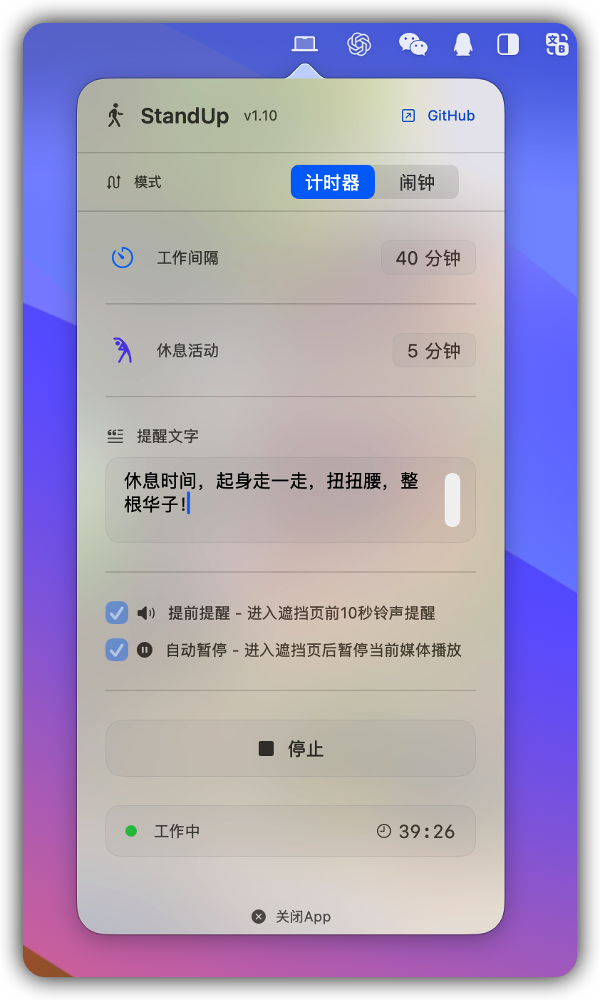

# StandUp - 避免久坐

一款简洁、原生的 macOS 菜单栏休息提醒工具，帮你有效避免久坐。原本想直接找款免费的用，无奈翻遍 App Store 和 GitHub 都没找到合适的，自己动手写了。

StandUp 通过周期性工作计时和全屏休息遮罩，提醒你暂时离开屏幕、起身活动、放松眼睛。除了常规的工作/休息循环，它还提供一次性闹钟模式，适合会议、喝水、服药或其他定时提醒场景。


## 📖 如在macOS下无法运行，请执行以下步骤：
> 系统设置 → 隐私与安全性 → 安全性 → 已阻止“StandUp.app”以保护Mac → 仍要打开

<p align="center">
  
</p>


## 功能介绍

### 工作与休息计时

- 自定义工作间隔，支持 `1～240` 分钟。
- 自定义休息时长，支持 `1～60` 分钟。
- 提供常用时长快捷选项，也可以手动输入时间。
- 菜单栏实时显示当前状态和距离下次休息的倒计时。
- 休息结束后自动开始下一轮工作计时。

### 全屏休息提醒

- 工作计时结束后显示沉浸式全屏提醒，减少忽略提醒的可能。
- 覆盖主显示器及所有外接显示器，支持横屏和竖屏布局。
- 主屏显示提醒文字、操作按钮和休息倒计时，副屏同步显示遮罩背景。
- 可以点击“开始休息”，也可以使用空格键或回车键快速开始。
- 休息过程中可以提前结束并继续工作。

### 个性化提醒

- 支持设置最长 20 个字符的自定义提醒文字。
- 内置多条健康提示语，每轮随机展示。
- 可选在全屏遮罩出现前 10 秒播放提示音。
- 可选在进入休息时暂停当前媒体，休息结束后恢复播放。

### 闹钟模式

- 支持选择具体日期和 24 小时时间。
- 最多可以同时添加 5 个一次性闹钟。
- 支持查看、编辑和删除已添加的闹钟。
- 闹钟触发时显示当前时间、提醒内容和全屏提示。
- 已保存的未到期闹钟会在应用重新启动后恢复。

### 原生 macOS 体验

- 常驻菜单栏，不占用 Dock 空间。
- 使用 SwiftUI 与 AppKit 构建，无第三方依赖。
- 设置和闹钟数据保存在本机 `UserDefaults` 中。
- 支持毛玻璃菜单、SF Symbols 和 macOS 原生交互。

## 系统要求

- macOS 14.0 或更高版本
- Apple Silicon 或 Intel Mac
- 从源码构建需要 Xcode16.2+ 和 Swift 5

## 从源码运行

1. 克隆本仓库并进入项目目录。
2. 使用 Xcode 打开 `StandUp.xcodeproj`。
3. 选择共享的 `StandUp` Scheme。
4. 点击 Run，或使用以下命令构建：

```bash
xcodebuild -project StandUp.xcodeproj -scheme StandUp \
  -configuration Debug CODE_SIGNING_ALLOWED=NO build
```

Release 构建：

```bash
xcodebuild -project StandUp.xcodeproj -scheme StandUp \
  -configuration Release CODE_SIGNING_ALLOWED=NO build
```

## 使用说明

1. 启动 StandUp，点击菜单栏中的电脑图标打开设置面板。
2. 在“计时器”模式中设置工作间隔、休息时长和提醒文字。
3. 根据需要开启提前提醒或自动暂停媒体。
4. 点击“开始”进入工作计时；计时结束后，按照全屏提示开始休息。
5. 如需指定时间提醒，切换到“闹钟”模式并添加闹钟。

> StandUp 启动后会自动开始工作计时。若需要完全退出，请在菜单面板底部点击“关闭 App”。

## 辅助功能权限

“**自动暂停媒体**”功能需要使用 macOS 辅助功能权限，以发送系统媒体播放/暂停按键事件。首次启动时，StandUp 会提示你前往：

`系统设置 → 隐私与安全性 → 辅助功能`

如果不使用自动暂停媒体功能，可以拒绝该权限；其他计时和提醒功能仍可正常使用。

## 项目结构

```text
StandUp/
├── App/                 # 应用入口
├── Models/              # 闹钟及显示模式等数据模型
├── Controllers/         # 计时、菜单栏、生命周期和遮罩窗口管理
├── Views/
│   ├── Menu/            # 菜单栏设置界面
│   ├── Components/      # 通用 SwiftUI 组件和 AppKit 桥接
│   └── Overlay/         # 全屏休息与闹钟界面
└── Resources/           # 图标、背景图片和提示音
```

项目遵循清晰的 MVC 职责划分：视图负责呈现状态和发送操作，控制器负责计时、持久化及窗口协调，模型保持为独立的数据类型。

## 参与贡献

欢迎提交 Issue。

- 本项目基于 [@heidebaiyang](https://github.com/heidebaiyang/Stop-Working) 二次开发。

## 许可证

本项目基于 [GNU General Public License v3.0](LICENSE) 开源。
